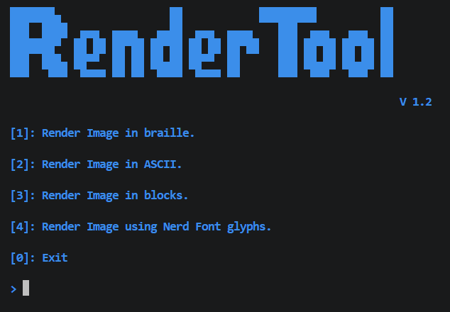
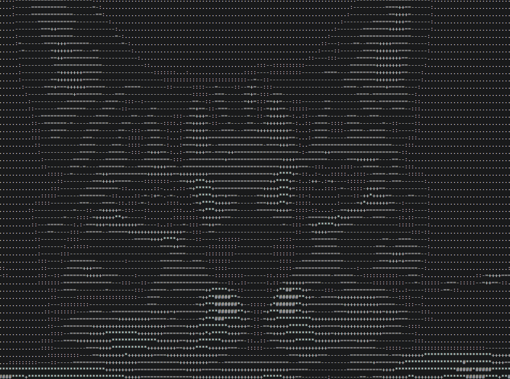

# RenderTool

RenderTool is a python CLI and TUI tool that can render images using:

- ASCII Characters

- Unicode block characters

- Unicode braille characters

- NerdFont Glyphs

it works by mapping brightness to characters, it is easily extendable by editing `Internal/chs.json.`

## Usage

RenderTool **should be used as a module**, with `py -m`, here is how that would look like:

```bash
git clone https://www.github.com/im-lemon/rendertool.git
pip install -r requirements.txt
py -m App.TUI # or App.CLI -m <mode> -p <img_path>
```

## Refrences


